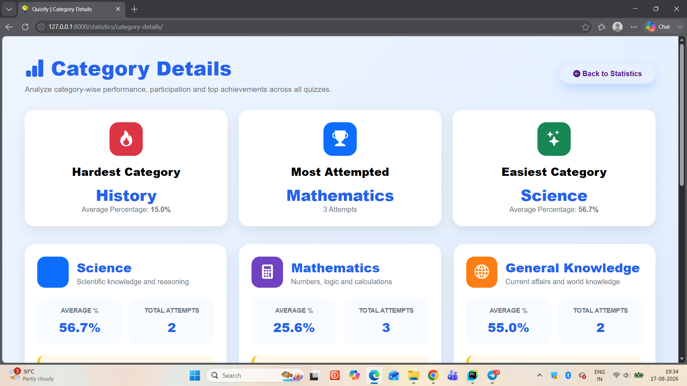
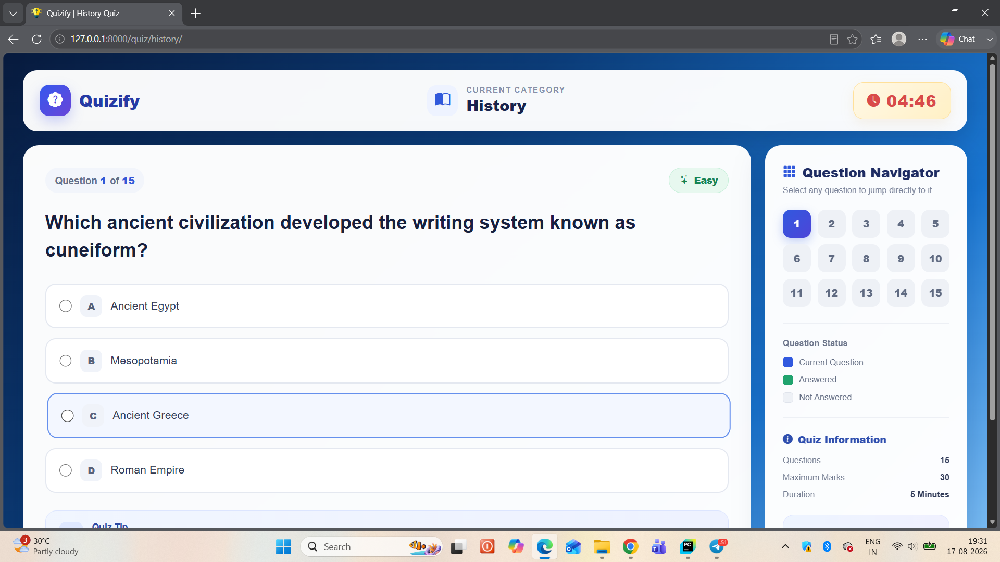
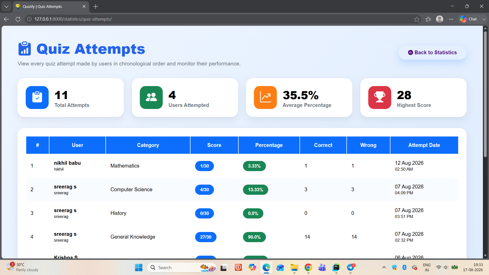
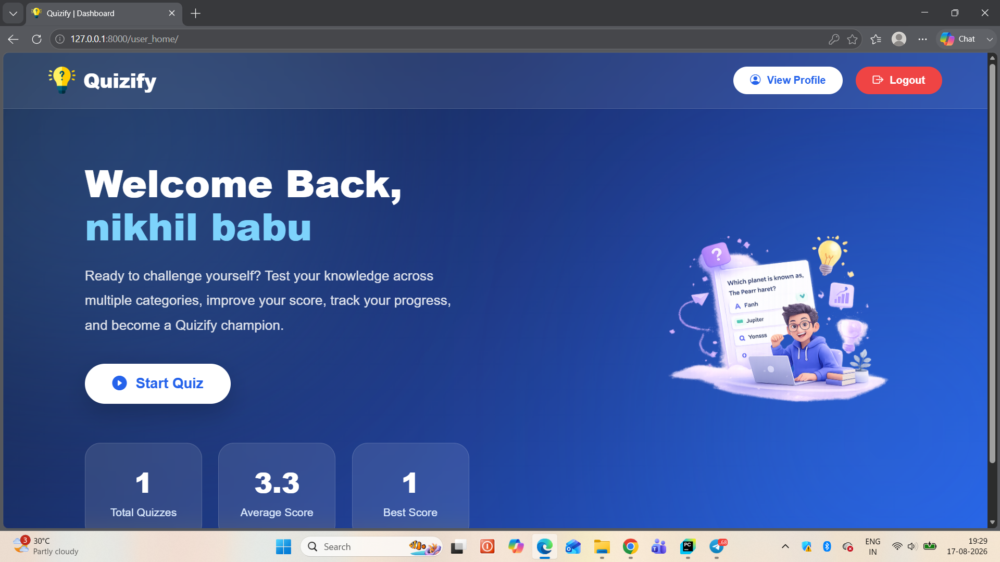
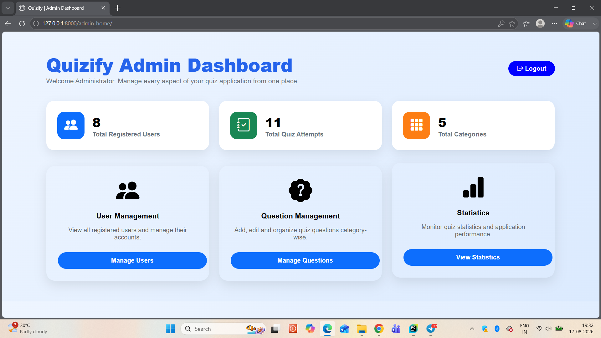
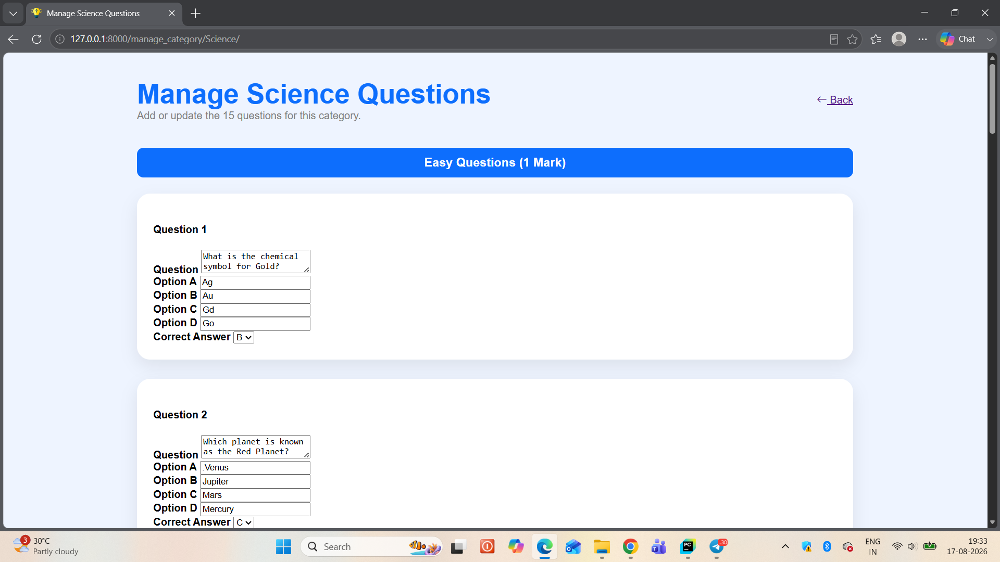
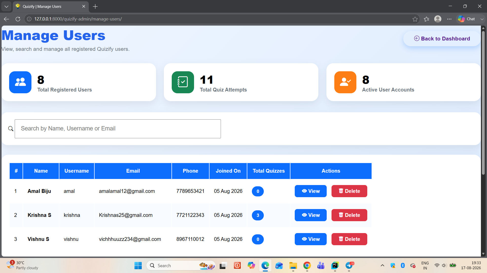

# 🧠 Quizify

### Django-based Online Quiz & Assessment Platform

Quizify is a Django-based web application designed to provide an interactive online quiz experience with multiple categories, difficulty levels, timed quizzes, automatic score calculation, result tracking, and administrative management.

The platform provides separate workflows for **users and administrators**, allowing users to register, participate in quizzes, view their results and performance, while administrators can manage questions, users, quiz versions, and statistics.

---
## 🌐 Live Demo

🔗 **[Open Quizify Demo](https://quizifyy.pythonanywhere.com/)**
## ✨ Features

### 👤 User Features

* User registration and login
* User logout and session-based authentication
* User profile management
* Password reset using email OTP verification
* Welcome email after registration
* Browse available quiz categories
* View quiz instructions before starting
* Attempt quizzes based on the selected category
* Difficulty-based questions
* Timed quiz experience
* Automatic score calculation
* Automatic calculation of correct, wrong, and attempted questions
* Percentage calculation
* Detailed result page
* Quiz attempt history
* User performance statistics
* Prevention of repeated attempts for the same quiz version

### 📚 Quiz Categories

Quizify currently includes:

* 🔬 Science
* ➗ Mathematics
* 🌍 General Knowledge
* 💻 Computer Science
* 📜 History

Each category uses three difficulty levels:

* **Easy** — 1 mark
* **Medium** — 2 marks
* **Hard** — 3 marks

The quiz system uses a total score of **30 marks**.

### 🛠️ Administrator Features

* Administrator dashboard
* User management
* View individual user details
* Delete users
* Manage questions by category
* Add and update quiz questions
* Manage correct answers and difficulty levels
* Quiz version management
* Monitor quiz attempts
* View overall quiz statistics
* View category-wise statistics
* Track average percentage and highest scores
* Manage the questions used in future quiz versions

---

## 🔄 Working Flows

### 👤 User Flow

```text
User Registration / Login
          ↓
      User Dashboard
          ↓
   Browse Categories
          ↓
   View Instructions
          ↓
      Start Quiz
          ↓
   Answer Questions
          ↓
    Submit Quiz
          ↓
 Automatic Score Calculation
          ↓
     View Results
          ↓
   View Quiz History
```

### 🔐 Password Reset Flow

```text
Forgot Password
      ↓
 Enter Registered Email
      ↓
   OTP Generated
      ↓
 OTP Sent via Email
      ↓
   Verify OTP
      ↓
 Reset Password
      ↓
 Return to Login
```

### 🛠️ Administrator Flow

```text
Administrator Login
        ↓
   Admin Dashboard
        ↓
 Manage Users / Questions
        ↓
 Update Quiz Questions
        ↓
   Quiz Version Updated
        ↓
 Users Can Attempt Updated Quiz
        ↓
 Monitor Attempts & Statistics
```

---

## 📊 Quiz & Result System

Quizify stores quiz attempts and results in the database.

For each attempt, the application records information such as:

* User
* Quiz category
* Quiz version
* Score
* Total marks
* Attempted questions
* Correct answers
* Wrong answers
* Percentage
* Completion date

The application also stores individual user answers associated with a quiz attempt.

### Quiz Versioning

Quizify uses a **quiz version system** to control repeated attempts.

When an administrator updates questions in a category, the corresponding quiz version is increased. This allows users to attempt the updated version while preventing repeated attempts of the same version.

---

## 🗂️ Project Structure

```text
Quizify/
│
├── app5/
│   ├── migrations/
│   ├── admin.py
│   ├── apps.py
│   ├── models.py
│   ├── views.py
│   └── tests.py
│
├── new_pro/
│   ├── settings.py
│   ├── urls.py
│   ├── asgi.py
│   └── wsgi.py
│
├── static/
│   ├── css/
│   ├── fonts/
│   ├── images/
│   ├── js/
│   └── scss/
│
├── templates/
│   ├── index.html
│   ├── login.html
│   ├── register.html
│   ├── category.html
│   ├── instruction.html
│   ├── result.html
│   ├── user_index.html
│   ├── admin_index.html
│   ├── manage_questions.html
│   ├── manage_category.html
│   ├── manage_users.html
│   ├── statistics.html
│   └── ...
│
├── manage.py
├── requirements.txt
└── README.md
```

---

## 🧩 Technologies Used

* **Python**
* **Django 6.0.7**
* **HTML5**
* **CSS3**
* **JavaScript**
* **Bootstrap**
* **SQLite3**
* **Django Email Backend**
* **Git & GitHub**

---

## ⚙️ Installation & Setup

### 1. Clone the repository

```bash
git clone <your-repository-url>
cd Quizify
```

### 2. Create a virtual environment

```bash
python -m venv .venv
```

### 3. Activate the virtual environment

**Windows:**

```bash
.venv\Scripts\activate
```

### 4. Install dependencies

```bash
pip install -r requirements.txt
```

### 5. Apply migrations

```bash
python manage.py migrate
```

### 6. Start the development server

```bash
python manage.py runserver
```

Open:

```text
http://127.0.0.1:8000/
```

---

## 🎯 Main Application Areas

| Area                | Purpose                   |
| ------------------- | ------------------------- |
| Home                | Introduction to Quizify   |
| Registration        | Create a user account     |
| Login               | Authenticate users        |
| Categories          | Browse quiz categories    |
| Instructions        | Display quiz instructions |
| Quiz                | Attempt questions         |
| Results             | Display quiz performance  |
| Profile             | View user information     |
| Admin Dashboard     | Administrative management |
| Question Management | Add/update quiz questions |
| User Management     | Manage registered users   |
| Statistics          | Analyze quiz performance  |

---

## 🚀 Future Improvements

Possible future improvements include:

* Secure password hashing using Django's authentication system
* Improved role-based authentication
* Cloud database integration
* Production deployment
* Advanced analytics and visualizations
* Leaderboards
* More quiz categories
* Mobile UI improvements
* API integration using Django REST Framework

---

## 👨‍💻 Project

**Quizify — Online Quiz & Assessment Platform**

Built using **Python and Django**.

---

## 📸 Screenshots

### 🏠 Home Page


### 📚 Quiz Categories


### 📖 Category Details



### 🧠 Quiz Interface



### 📜 Quiz History



### 👤 User Dashboard



### 🛠️ Admin Dashboard



### 📝 Question Management



### 👥 User Management

